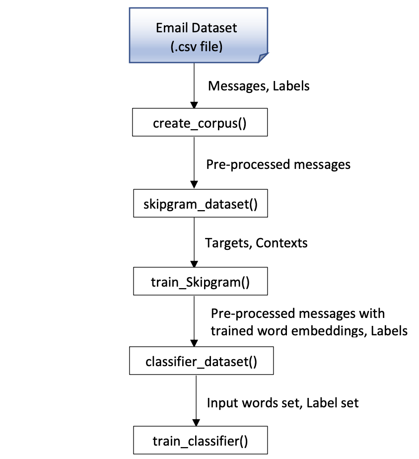
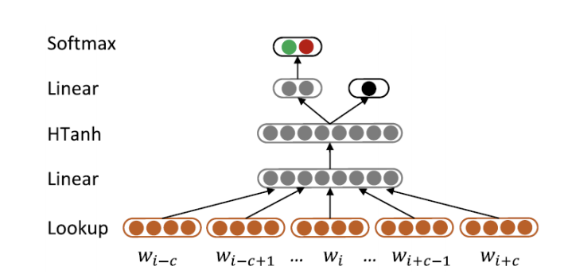
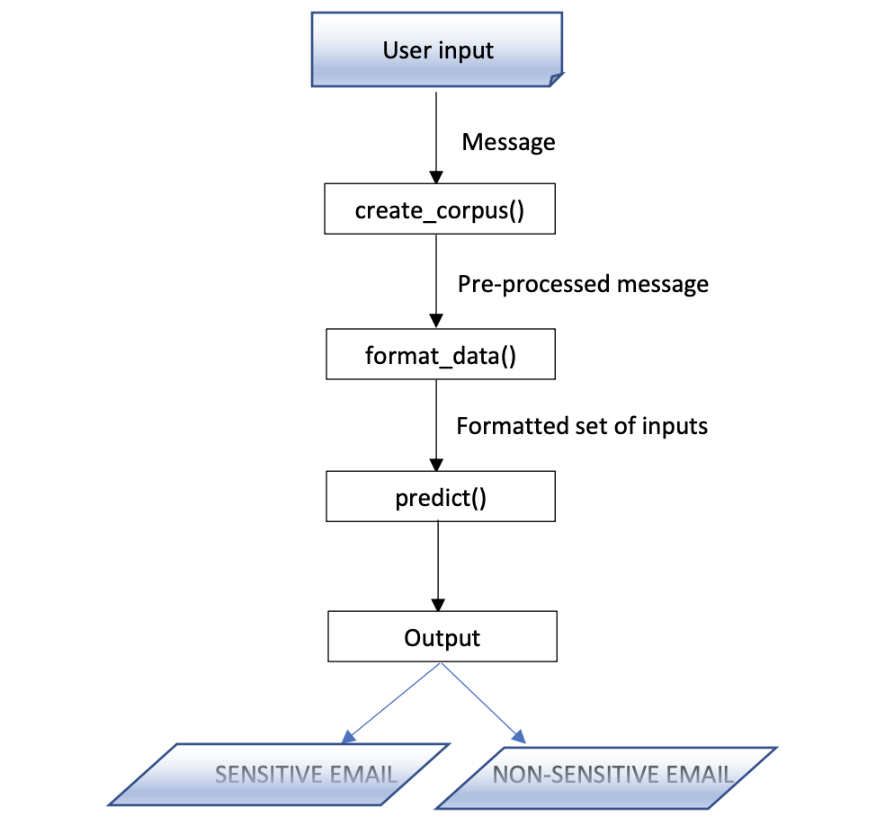

# Sensititvity-Analysis

- [Sensititvity-Analysis](#sensititvity-analysis)
  * [Overview](#overview)
  * [How to run?](#how-to-run-)
  * [Code description](#code-description)
  * [Experimentation and results](#experimentation-and-results)

## Overview
This module uses a feed forward neural network to detect a sensitive email. It is a classifier where the context of sensitivity is learned based on the emails which are labelled as sensitive. It has an important application in email editors where confidential emails can be checked before being sent ahead.

## How to run?

To train the model using the training dataset (`training_data.csv`), run the `training.py` script

    python training.py

To train the model using the training dataset (`testing_data.csv`), run the `testing.py` script

    python testing.py

After the training is complete, the predictions of the new input emails can be obtained by executing 'sensitivity_predictor.py' script.

    python sensitivity_predictor.py

## Code description
The `training.py` script that trains the neural network to identify sensitive mails has the following flow of control:

- Email Dataset

    This forms the input to the model. This dataset is fed to this code in csv format. A dummy dataset has been generated for testing purpose using the Enron Emails dataset.
    Each row consists of two columns as follows:
    1. “Label” (Column 1): It consists of message's label (1 for sensitive; 0 for non-sensitive)
    2. “Message” (Column 2): It consists of individual sentences of an email.
    There are 581178 rows in this dataset with 127044 sensitive labels and 454134 non-sensitive
    labels

- create_corpus()

    This method pre-processes the email dataset. Here, the stop words are removed, punctuations are dropped, repeated characters are eliminated and the finally the words are reduced
    to their root forms. This aids in reducing vocabulary size which further facilitates efficient training.

- skipgram_dataset()
    This method uses the pre-processed corpus to generate the training-context pairs as required by the skipgram model.

- train_skipgram()
    In this method, a neural network is trained to learn context of related words. The continuous word embeddings are generated in the form of vectors. These word embeddings improve the training of sensitivity classifier.

- classifier_dataset()
    This method generates inputs (of specified window-size) with associated labels for training the sensitivity classifier. For each input, a noise input is also explicitly generated for noise contrastive estimation.

- train_classifier()
    This is the most important method where training of the classifier is performed. The classifier neural network has been designed with layers as follows:

[Update] skipgram_generator.py

Skipgram training has been isolated in skip_generator.py. It trains word embeddings for the words of the entire data-set before training the classifier. It runs on the `generated_data.csv`.

In this model, a hybrid neural network is used, as shown in figure 1, which analyses both the sensitivity of texts as well as the contexts of words. This facilitates efficient learning leading to better results. This model uses noise contrastive estimation to calculate loss and update the weights of the neural network. This significantly cuts down the computational cost against comprising only a marginal accuracy.

After the training is complete, this method saves the parameters of the neural network for future use. The parameters thus trained are later loaded into the Sensitivity Predictor for prediction.

After the neural network inputs are prepared, they are forward propagated in the neural network as shown in figure 2. The values obtained in the final 2-neurons softmax layer are compared to predict the sensitivity of the input. The predicted output is displayed on the console as “SENSITIVE EMAIL” or “NON-SENSITIVE” email.

## Experimentation and results

The above codes were executed on a GPU with RAM: 32 GB and GPU: GeForce GTX 1080 Ti

The execution time of `training.py` is around 35-40 minutes. This involves data processing, skipgram training and the classifier training.

The `sensitivity_predictor.py` executes in milliseconds where it prompts the user for input and returns the prediction instantaneously.

### Parameters for the same are specified as follows:
• Embedding size: 70
• Skipgram window size: 7 (7 left+ 7 right)
• Classifier window size: 7
• Hidden layer neurons: 20
• No. of noise samples in classifier (k): 25 

Accuracy obtained: 90.7%

# Next part: [Recipient Analysis](https://github.com/rajshrivastava/Recipient-Analysis)
